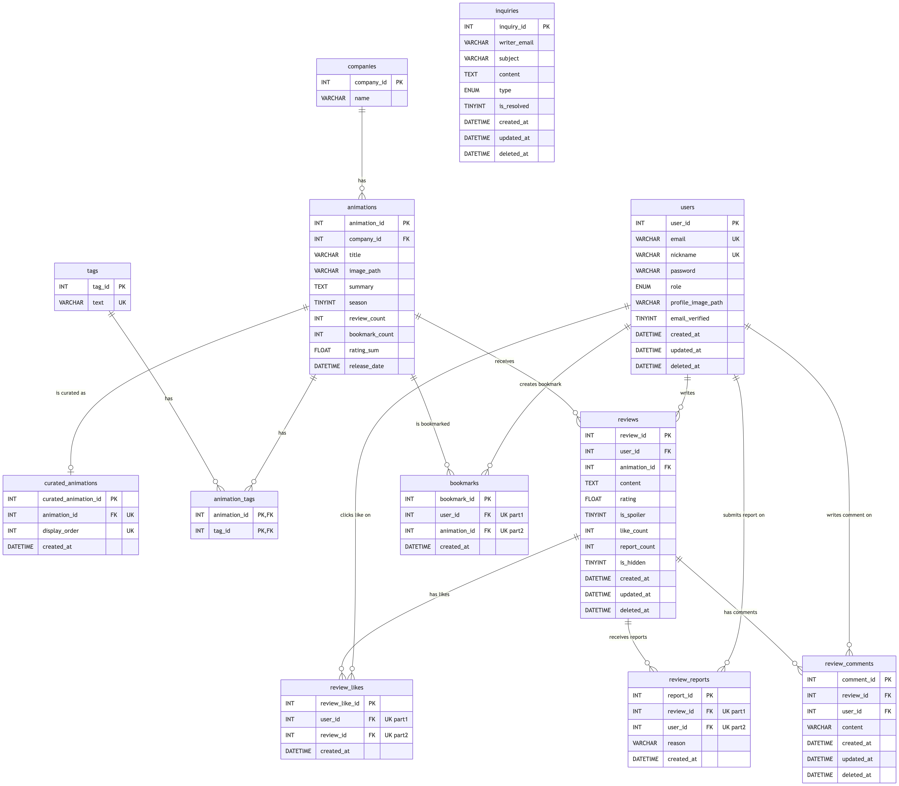

# 🎬 Anipia (애니피아) 백엔드 프로젝트

**Anipia**는 사용자들이 애니메이션 정보를 탐색하고, 자신만의 리뷰를 작성하여 다른 유저들과 공유할 수 있는 커뮤니티 서비스입니다. 
본 백엔드 시스템은 대량의 데이터 조회 최적화와 안정적인 서버 운영, 그리고 **개발 생산성 향상을 위한 CI/CD 배포 자동화**에 중점을 두고 개발되었습니다.

👉 **[프론트엔드 레포지토리 보러가기](https://github.com/ch02111/globalin-anipia-frontend)**

<br/>

## ✨ 주요 기능
- **사용자 인증:** JWT를 활용한 안전한 로그인 및 세션 관리
- **애니메이션 탐색:** 다양한 기준의 애니메이션 정보 조회, 검색 및 필터링 기능
- **리뷰 커뮤니티:** 애니메이션에 대한 리뷰 작성, 조회, 수정, 삭제(CRUD) 기능
- **태그 분류:** 태그를 기반으로 한 직관적인 애니메이션 큐레이션 및 조회 기능

<br/>

## 🛠️ 기술 스택
- **Backend:** Java 17, Spring Boot, Spring Security, MyBatis
- **Database:** MariaDB, Redis
- **Deployment:** Docker, AWS (S3, ECS Fargate, ECR)
- **CI/CD:** GitHub Actions, AWS CodePipeline

<br/>

## ⚙️ CI/CD 파이프라인 (자동화 아키텍처)
수동 배포로 인한 시간 지연과 비효율을 해결하기 위해 **Github Actions를 활용한 CI/CD 파이프라인을 구축**했습니다.
- **CI (지속적 통합):** Github Repository에 코드가 Push/Merge 되면 Github Actions가 즉시 작동하여 자동 빌드 및 테스트를 수행합니다.
- **CD (지속적 배포):** 빌드가 완료된 코드는 팀의 AWS 인프라 환경으로 자동 배포되어, 개발 팀원이 인프라 관리에 신경 쓰지 않고 핵심 비즈니스 로직(Spring Boot) 개발에만 집중할 수 있는 효율적인 프로세스를 확립했습니다.

<br/>

## 🚀 시작 가이드 (Local Setup)
로컬 환경에서 프로젝트를 설정하고 실행하는 방법입니다.

### 1. 전제 조건
- Java 17
- Docker Desktop (Docker Compose 포함)

### 2. 설치 및 실행
본 프로젝트는 Docker Compose를 이용해 데이터베이스(MariaDB, Redis) 컨테이너를 먼저 띄운 후, Spring Boot 애플리케이션을 실행하는 방식을 권장합니다.

```bash
# 1. DB 및 Redis 컨테이너를 백그라운드에서 실행합니다.
docker-compose up -d

# 2. Spring Boot 애플리케이션을 실행합니다. (IDE 직접 실행 또는 아래 명령어 사용)
./gradlew bootRun
```

<br/>

## ⚠️ 중요: 환경 설정 파일(Security) 안내
보안상의 이유로(DB 접속 정보, JWT 시크릿 키, AWS 자격 증명 등) `application.yaml` 및 관련 설정 파일은 `.gitignore` 처리가 되어 리포지토리에 업로드되지 않았습니다. 
프로젝트를 정상적으로 실행하려면 `src/main/resources/` 경로에 `application.yaml` 파일을 직접 생성하고, 아래의 템플릿을 참고하여 본인의 환경에 맞게 값을 입력해야 합니다.

<details>
<summary><b>application.yaml 템플릿 보기 (클릭)</b></summary>

```yaml
# src/main/resources/application.yaml
server:
  servlet:
    context-path: /api

spring:
  application:
    name: anipia
  cloud:
    aws:
      credentials:
        access-key: # AWS IAM 액세스 키
        secret-key: # AWS IAM 시크릿 키
      region:
        static: ap-northeast-2
      stack:
        auto: false
  servlet:
    multipart:
      max-file-size: 10MB
      max-request-size: 10MB
  datasource:
    url: jdbc:mariadb://localhost:3306/anipia
    username: root # docker-compose.yml에 설정된 DB 계정
    password: 1234 # docker-compose.yml에 설정된 DB 비밀번호
    driver-class-name: org.mariadb.jdbc.Driver
  data:
    redis:
      host: localhost
      port: 6379
  mail:
    host: smtp.gmail.com
    port: 587
    username: # 본인 Gmail 주소
    password: # Gmail 앱 비밀번호
    properties:
      mail:
        smtp:
          auth: true
          starttls:
            enable: true
  output:
    ansi:
      enabled: always

logging:
  level:
    com.afivestudio.anipia: DEBUG

mybatis:
  mapper-locations: classpath:mapper/**/*.xml
  type-aliases-package: com.afivestudio.anipia.**.domain, com.afivestudio.anipia.**.dto
  configuration:
    map-underscore-to-camel-case: true
    default-enum-type-handler: org.apache.ibatis.type.EnumTypeHandler
    log-impl: org.apache.ibatis.logging.slf4j.Slf4jImpl

security:
  cors:
  allowed-origins:
    - http://localhost:5173
  whitelist:
    - pattern: /error
    # user
    - method: POST
      pattern: /users
    - method: GET
      pattern: /users/check-nickname
    - method: GET
      pattern: /users/check-email
    # auth
    - method: POST
      pattern: /auth/login
    - method: POST
      pattern: /auth/reissue
    - method: POST
      pattern: /auth/verify-email
    - method: POST
      pattern: /auth/password-reset/request
    - method: GET
      pattern: /auth/password-reset/verify
    - method: PATCH
      pattern: /auth/password-reset/confirm
    # tag
    - method: GET
      pattern: /tags
    # company
    - method: GET
      pattern: /companies
    # inquiry
    - method: POST
      pattern: /inquiries
    - method: GET
      pattern: /inquiries
    # animation
    - method: GET
      pattern: /animations
    - method: GET
      pattern: /animations/curated
    - method: GET
      pattern: /animations/**
    # review
    - pattern: /reviews/**
      method: GET
    # swagger
    - pattern: /v3/api-docs/**
    - pattern: /swagger-ui/**
    - pattern: /swagger-resources/**

  jwt:
    secret-key: # 자체 생성한 JWT 시크릿 키 입력
    access-token-expiration: 3h
    refresh-token-expiration: 30d

app:
  user:
    default-profile-image-path: "static/defaults/user-profiles/fcfb9048-b48d-4535-beb3-8745ee9a612f.png"
  auth:
    email-verification-url: http://localhost:5173/auth/verify
    email-code-expiration: 5m
    password-reset-url: http://localhost:5173/auth/password-reset/confirm
    password-token-expiration: 5m
  file:
    s3:
      bucket: # AWS S3 버킷 이름
```
</details>

<br/>

## 🗄️ 데이터베이스 스키마
프로젝트 초기화에 필요한 데이터베이스 스키마는 `init.sql` 파일에 포함되어 있습니다. 아래는 본 프로젝트의 ERD(Entity Relationship Diagram) 구조입니다.



<br/>

## 📄 API 엔드포인트 명세
주요 API 엔드포인트의 세부 규격과 테스트는 Swagger UI를 통해 확인할 수 있습니다.
애플리케이션을 정상적으로 실행한 뒤, 아래 주소로 접속해 주세요.
- `http://localhost:8080/swagger-ui/index.html`
